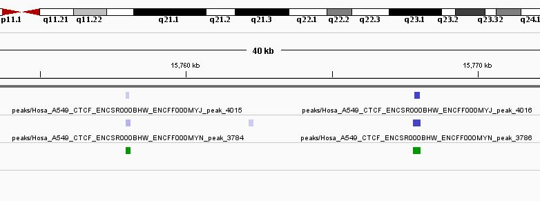

```{r style, echo = FALSE, results = 'asis'}
BiocStyle::markdown()
```

<br />

Authors: Astrid Louise Deschenes, Fabien Claude Lamaze, Pascal Belleau 
and Arnaud Droit <br />
Compilation date: `r Sys.Date()`


## Licensing

This package and the underlying `consensusSeekeR` code are distributed 
under the Artistic license 2.0. You are free to use and redistribute this 
software.


## Introduction

The genome is commonly represented as a linear sequence, split up in 
multiple chromosomes. Genome data, such as genes, nucleosomes or 
single-nucleotide polymorphisms (SNPs) are linked to the genome by 
occupying either a range of 
positions or a single position on the sequence. Genomic related data 
integration is made possible by treating the data as 
ranges on the genome, which acts as a common scaffold [@Lawrence2013]. 
Bioconductor as developed an infrastructure, including packages such as 
`r Biocpkg("GenomicRanges")`,  `r Biocpkg("IRanges")` and 
`r Biocpkg("GenomicFeatures")`, to facilitate 
the integrative statistical analysis of range-based genomic data.

Ranges have a fundamental role in the analysis of experimental data. As 
an example, the peak calling step, in the analysis of ChIP-seq data, generally
generated narrow peaks outputs, used by the ENCODE project [@Dunham2012], 
which include a peak position located inside 
a genomic range. Even more, the analysis of gene expression, using RNA-seq 
data, is based on counting the alignments overlapping exons which can be 
translated as genomic ranges.

In genomic analysis where feature identification generate a position value 
surrounded by a genomic range, such as in ChIP-Seq and nucleosome postioning, 
the replication of the analyses may result in slight differences between 
predicted values. Conciliation of the results can be difficult, especially 
when many replicates are done.

One approach often used to identify consensus in a group of results consist of 
using the overlapping regions of the genomic ranges. This approach, when use on
a large group of experiments, can miss, as a side effect, regions when one of 
the experiment has missing features or slightly shift ones. On the other hand,
the use of the union of the regions cans result in wide consensus ranges.

The `consensusSeekeR` package implements a novative way to identify consensus 
ranges in a group of experiments which generated position values
surrounded by a genomic ranges. The `consensusSeekeR` package is characterized 
by its use of the position values, instead of the genomic range, to identify
the consensus regions.

## The consensusSeekeR package

The `consensusSeekeR` package implements a novative way to identify consensus 
ranges in a group of experiments which generated position values
surrounded by a genomic ranges. The `consensusSeekeR` package is characterized 
by its use of the position values, instead of the genomic range, to identify
the consensus regions.

Using iterative steps on ordered peak position values from all experiments, 
a window of fixed size (specified by user) with the current position value as 
starting point is set. All 
position values which reside inside the window are gathered to calculate the 
median position which is then used to recreate a new window. This time, the 
new window has twice the size fixed by user and its center is the median of 
the peak positions. An 
update of the peaks located inside the window is done and a new 
median position is calculated. This step is repeated up to the moment that 
the set of peaks become stable. The final set of peak positions is
used to fix
the central position of the consensus region. This final 
region must respect the minimum number of experiments with at least 
one peak inside it to be retained as an final consensus region. The minimum 
number of experiments is set by the user. At last, the consensus region can be
extended or shrinked to fit the regions associated to the position values 
present inside. If new position values are added during the extension, the
extension step is not reprocess to include those new position
values.


## Loading consensusSeekeR package

As with any R package, the `consensusSeekeR` package should first be loaded 
with the following command:

```{r loadingPackage, warning=FALSE, message=FALSE}
library(consensusSeekeR)
```


## Inputs

## Using consensusSeekeR on nucleosome positions data   

Global gene expression patterns are established and maintained by the 
concerted actions of Transcription Factors (TFs) and the proteins that 
constitute chromatin. The key structural element of chromatin is the 
nucleosome, which consists of an octameric histone core wrapped by 147 bps 
of DNA and connected to its neighbor by approximately 10-80 pbs of linker 
DNA [@Kornberg1999]. Nucleosome occupancy and positioning have proved to be 
dynamic. It also have a major impact on expression, regulation, and evolution 
of eukaryotic genes

### Comparing nucleosome positioning results

With the development of the Next-generation sequencing, nucleosome 
positioning using MNase-Seq data or MNase- or sonicated- ChIP-Seq data 
combined with either single-end or paired-end sequencing have evolved as 
popular techniques. Software such as PING [@Woo2013] and NOrMAL
[@Polishko2012], generates output which contain the position of the
predicted nucleosomes, which simply are a one pair base position on
the reference genome. A range of $\pm$ 74 bps is usually superposed to the
predicted nucleosome to repesent the nucleosome occupancy.

## Using consensusSeekeR on ChIP-Seq data

Next-generation DNA sequencing coupled with chromatin immunoprecipitation 
(ChIP-seq) has changed the ability to interrogate whole genome protein-DNA 
interactions by enabeling  genomic localization of histone 
modifications and transcription-factor binding in living cells [@Mundade2014]. 
Consortium, 
such as [ENCODE](https://www.encodeproject.org) have developed, and 
constantly upgrading, a set of standards and guidelines for ChIP experiments 
[@Landt2012].

ChIP-seq combines chromatin immunoprecipitation (ChIP) with massively parallel 
DNA sequencing. The
obtained sequence reads are first mapped to the reference genome of the 
organism used in the experiments. Bindind sites are them dectected by using
software specialized in transcript factor binding sites identification, such 
MACS [@Zhang2008] and PeakRanger [@Feng2011]. Peaks
are defined as a single base pair position.

### ChIP-Seq replicates from one experiment

The Encyclopedia of DNA Elements (ENCODE) Consortium is an international 
collaboration of research groups funded by the National Human Genome Research 
Institute. The [ENCODE website](https://www.encodeproject.org) is a portal 
giving access to the data generated by the ENCODE Consortium. The amount of 
data gathered is extensive. Moreover, for some experiments, more than 
one ChIP-Seq replicate is often available.

The software used to identify transcript factor binding sites generally 
generates a peak position and a narrow region region for each binding site. 
However, it is quite unlikely that the exact peak position is exactly the same 
across replicates. Even more, there is not yet a consent on how to analyze 
multiple-replicate ChIP-seq samples [@Yang2014].

The `consensusSeekeR` package can be used to identify consensus regions for
two or more replicates ChIP-Seq samples. The consensus regions are being found 
by using the peak positions.

The transcription factor binding for the CTCF transcription factor have been
analyzed and 2 replicates are available in BAM files format on 
[ENCODE website](https://www.encodeproject.org) (DCCs: 
ENCFF000MYJ and ENCFF000MYN). 

(TODO FABIEN : ajouter une courte description 
sur la methode pour obtenir narrowPeaks). 

To simplify this demo, only part of chromosome chr1:245000000-249250620 and 
chromosome chr10:10000000-20000000 have been retained in 
the datasets. 

First, the `consensusSeekeR` package must be loaded.

```{r libraryLoad, warning=FALSE, message=FALSE}
library(consensusSeekeR)
```

The datasets, which are included in the `consensusSeekeR` package, 
have to be loaded.

```{r loadingDatasets}
## Loading datasets
data(A549_CTCF_MYN_NarrowPeaks_partial)
data(A549_CTCF_MYN_Peaks_partial)
data(A549_CTCF_MYJ_NarrowPeaks_partial)
data(A549_CTCF_MYJ_Peaks_partial)
```

To be able to identify data from the same experiment, each row of the dataset
has to be assigned am experiment name. Beware that NarrowPeak and Peak 
datasets from the same experiment must assigned identical names. In this 
exemple, datasets are replicates of the same experiment. So, the names 
"rep01" and 
"rep02" are going to be assigned to each dataset.


```{r repAssignment}
## Assigning experiment name "rep01" to the first replicate
names(A549_CTCF_MYJ_NarrowPeaks_partial) <- rep("rep01",
                        length(A549_CTCF_MYJ_NarrowPeaks_partial))
names(A549_CTCF_MYJ_Peaks_partial) <- rep("rep01",
                        length(A549_CTCF_MYJ_Peaks_partial))

## Assigning experiment name "rep02" to the second replicate
names(A549_CTCF_MYN_NarrowPeaks_partial) <- rep("rep02",
                        length(A549_CTCF_MYN_NarrowPeaks_partial))
names(A549_CTCF_MYN_Peaks_partial) <- rep("rep02",
                        length(A549_CTCF_MYN_Peaks_partial))
```
The consensus regions for chromosome 10 only are calculated 
with a defaut region size of 200 bases pairs (2 * `extendingSize`)
The regions are extended to include all peaks regions 
(`expandToFitPeakRegion` = `TRUE` and `shrinkToFitPeakRegion` = `TRUE`).
A peak from both replicates must be present in a region to be retained as a 
consensus region.

```{r replicateConsensus}
## Only choromsome 10 is going to be analysed
chrList <- Seqinfo("chr10", 135534747, NA)

## Find consensus regions with both replicates inside it
results <- findConsensusPeakRegions(
            narrowPeaks = c(A549_CTCF_MYJ_NarrowPeaks_partial,
                                A549_CTCF_MYN_NarrowPeaks_partial),
            peaks = c(A549_CTCF_MYJ_Peaks_partial,
                                A549_CTCF_MYN_Peaks_partial),
            chrInfo = chrList,
            extendingSize = 100,
            expandToFitPeakRegion = TRUE,
            shrinkToFitPeakRegion = TRUE,
            minNbrExp = 2,
            nbrThreads = 1)

head(results$consensusRanges)
```

A total of `r length(results$consensusRanges)` consensus regions have been 
found. A exemple of the consensus regions (in green) is shown here using 
Integrative genomics viewer [@Interests2011]:




### ChIP-Seq data from multiple experiments

The `consensusSeekeR` package can also be used to identify consensus regions 
for two or more ChIP-Seq samples from multiple experiments. While the 
consensus regions are being found by using the peak positions, the TODO.

The transcription factor binding for the CTCF transcription factor have been
analyzed and 2 replicates are available in BAM files format on 
[ENCODE website](https://www.encodeproject.org) (DCCs: 
ENCFF000MYJ and ENCFF000MYN) [@Dunham2012].

(TODO FABIEN : ajouter une courte description 
sur la methode pour obtenir narrowPeak).

## Effect of the extendingSize parameter

The value of the `extendingSize` parameter can affect the final number of 
consensus regions. While small `extendingSize` value can miss some regions, 
large `extendingSize` value can gather consensus regions. Testing a range 
of `extendingSize` parameters can be an option worth considering.

##  Parallelizing consensusSeekeR

Due to the size of the analyzed genomes, the `findConsensusPeakRegions` 
function can take long to process.  However, a job can be separated by 
chromosome and run in parallel. This takes advantage of multiple 
processors and reduce the total execution time. This number of threads 
used by the  can be set with
the `minNbrExp` parameter in the `findConsensusPeakRegions` function. However, 
Windows does not support multicore evaluation.

## References

