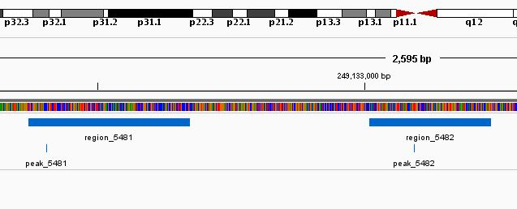
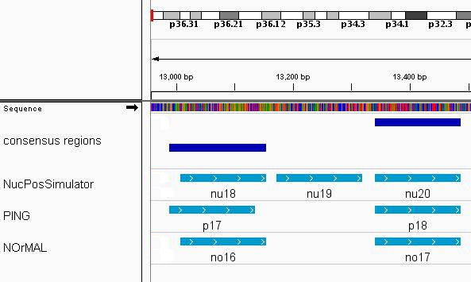
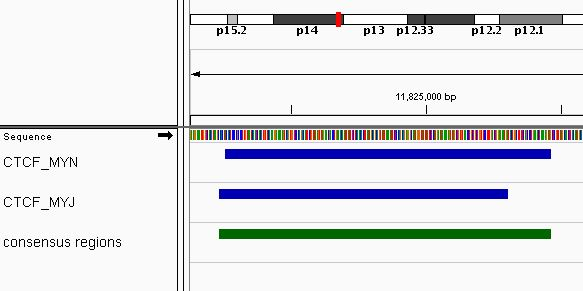
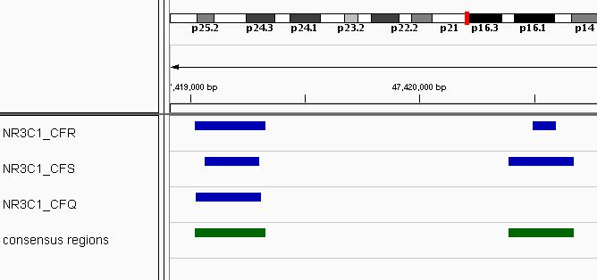
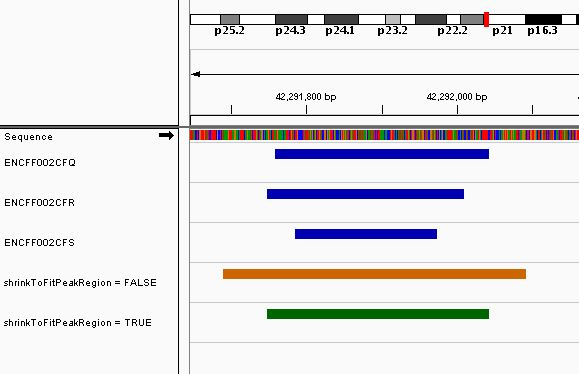
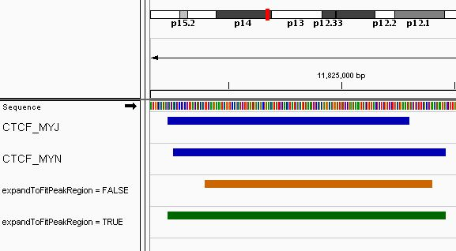
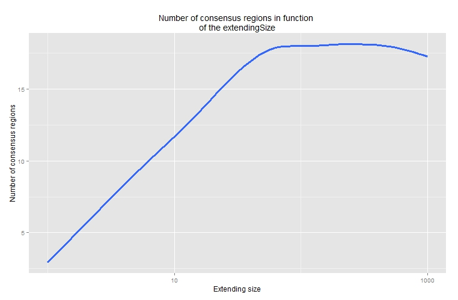

```{r style, echo = FALSE, results = 'asis'}
BiocStyle::markdown()
```

<br />

# Licensing

This package and the underlying `r Rpackage("consensusSeekeR")` code are 
distributed under the Artistic license 2.0. You are free to use and 
redistribute this software.


# Introduction

Genome data, such as genes, nucleosomes or 
single-nucleotide polymorphisms (SNPs) are linked to the genome by 
occupying either a range of 
positions or a single position on the sequence. Genomic related data 
integration is made possible by treating the data as 
ranges on the genome [@Lawrence2013]. 
Bioconductor has developed an infrastructure, including packages such as 
`r Biocpkg("GenomicRanges")`,  `r Biocpkg("IRanges")` and 
`r Biocpkg("GenomicFeatures")`, which facilitate 
the integrative statistical analysis of range-based genomic data.

Ranges format is a convenient way for the analysis of diffent experimental 
genomic data. As 
an example, the peak calling step, in the analysis of ChIP-seq data, commonly
generates NarrowPeak outputs. The NarrowPeak format, wich is used by the 
ENCODE project [@Dunham2012a], 
includes a peak position located inside 
a genomic range. 

In genomic analysis where feature identification generate a position value 
surrounded by a genomic range, such as ChIP-Seq peaks and nucleosome postions, 
the replication of an experiment may result in slight differences between 
predicted values. Conciliation of the results can be difficult, especially 
when many replicates are done. One current approach used to identify 
consensus regions in a group of 
results consist of extracting the overlapping regions of the genomic 
ranges. This approach, 
when used on a large number of experiments, can miss, as a side effect, 
regions when one of the experiment has missing or slightly shift 
features. On the 
other hand, the use of the union of the regions can result in wide 
consensus ranges.

As an example, shown using Integrative genomics viewer [@Interests2011], of 

two ChIP-Seq peaks from [ENCODE](https://www.encodeproject.org) 
for the FOSL2 transcription 
factor (DCC accession: ENCFF002CFN). The data have been analyzed using 
MACS2 [@Zhang2008] 
with the default parameters and the q-value set to 0.05. The ChIP-Seq peak 
is a genomic feature 
that can be defined by a position value (the peak position) and a genome
range (the enriched region). This example shows that the peak position is not
necessarily at the center of the enriched region.



The `r Rpackage("consensusSeekeR")` package implements a novative way to 
identify consensus which use the features positions, instead of the most 
commonly used genomic ranges.


# The consensusSeekeR package

The `r Rpackage("consensusSeekeR")` package implements a novative way to 
identify consensus 
ranges in a group of experiments which generated position values
surrounded by genomic ranges. The `r Rpackage("consensusSeekeR")` package is 
characterized by its use of the position values, instead of the genomic 
ranges, to identify the consensus regions. The positions values have the
double advantages of being, most of the time, 
the most important information from features and allowing creation of
consensius regions of smaller ranges.

Using iterative steps on ordered features position values from all 
experiments, a window of fixed size (specified by user) with the 
current feature position 
as starting point is set. All 
features which reside inside the window are gathered to calculate a 
median feature position which is then used to recreate a new window. This 
time, the 
new window has twice the size fixed by user and its center is the median 
feature position. An 
update of the features located inside the window is done and the 
median feature position is recalculated. This step is repeated up to the 
moment that 
the set of features remains identical between two iterations. 
The final set of features positions is used to fix
the central position of the consensus region. This final 
region must respect the minimum number of experiments with at least one 
feature inside it to be retained as a final consensus region. The minimum 
number of experiments is set by the user. At last, the consensus region can be
extended or/and shrinked to fit the regions associated to the position values 
present inside. If new features positions are added during the consensus 
region resizing, the iterative steps are not reprocessed. It is possible 
that the extension step adds new features in the extended consensus region. 
However, those new features ranges won't be taken into account during the
extension step.


# Loading consensusSeekeR package

As with any R package, the `r Rpackage("consensusSeekeR")` package should 
first be loaded with the following command:

```{r loadingPackage, warning=FALSE, message=FALSE}
library(consensusSeekeR)
```


# Inputs

The main function of the `r Rpackage("consensusSeekeR")` is 
`findConsensusPeakRegions`. The mains inputs of the `findConsensusPeakRegions` 
function are:

1. a `GRanges` of the feature `positions` of all experiments with a 
metadata field called `name`. 
2. a `GRanges` of the feature `ranges` for all experiments with a metadata 
field called `name`. 


Both inputs must satified those conditions:

* All rows of each `GRanges` must be named by the experiment source. All 
entries from the same experiment must be assigned the same name.
* Each feature must have one entry in both `GRanges`. The metadata 
field  `name` is used to associate the feature position to its range. 

This is an example showing how a metadata field `name` can easily 
be created and row names can be assigned:

```{r input, echo=FALSE}
### Load dataset
data(A549_FOSL2_01_NarrowPeaks_partial)

### Remove dataset metadata field "name"
A549_FOSL2_01_NarrowPeaks_partial$name        <- NULL
A549_FOSL2_01_NarrowPeaks_partial$score       <- NULL
A549_FOSL2_01_NarrowPeaks_partial$qValue      <- NULL
A549_FOSL2_01_NarrowPeaks_partial$pValue      <- NULL
A549_FOSL2_01_NarrowPeaks_partial$signalValue <- NULL
A549_FOSL2_01_NarrowPeaks_partial$peak        <- NULL
```

```{r setName, collapse=TRUE}
### Initial dataset without metadata field
head(A549_FOSL2_01_NarrowPeaks_partial, n = 3)

### Adding a new metadata field "name" unique to each entry
A549_FOSL2_01_NarrowPeaks_partial$name <- paste0("FOSL2_01_entry_", 
                                1:length(A549_FOSL2_01_NarrowPeaks_partial))

### Assing the same row name to each entry
names(A549_FOSL2_01_NarrowPeaks_partial) <- rep("FOSL2_01", 
                                length(A549_FOSL2_01_NarrowPeaks_partial))

### Final dataset with metadata field 'name' and row names
head(A549_FOSL2_01_NarrowPeaks_partial, n = 3)
```

```{r inputClean, echo=FALSE}
### Remove dataset
rm(A549_FOSL2_01_NarrowPeaks_partial)
```

# Read NarrowPeak files

The NarrowPeak format is often used to provide called peaks of signal 
enrichment based on pooled, normalized data. The `r Biocpkg("rtracklayer")`
package has functions which faciliate the loading of the NarrowPeak files.

Since the main function of the `r Rpackage("consensusSeekeR")` needs 2 
`GRanges` objects, some manipulations are needed to create one `GRanges` for 
the regions and one `GRanges` for the peaks.

```{r rtracklayer, collapse=TRUE}
### Load the needed packages
library(rtracklayer)
library(GenomicRanges)

### Demo file contain inside the consensusSeekeR package
file_narrowPeak <- system.file("extdata",
        "A549_FOSL2_ENCSR000BQO_MZW_part_chr_1_and_12.narrowPeak", 
        package = "consensusSeekeR")

### Information about the extra columns present in the file need
### to be specified
extraCols <- c(signalValue = "numeric", pValue = "numeric",
                            qValue = "numeric", peak = "integer")

### Create genomic ranges for the regions
regions <- import(file_narrowPeak, format = "BED", extraCols = extraCols)

### Create genomic ranges for the peaks
peaks           <-  regions
ranges(peaks)   <-  IRanges(start = (start(regions) + regions$peak + 1L), 
                            width = rep(1, length(regions$peak)))

### First rows of each GRanges object
head(regions, n = 3)
head(peaks, n = 3)
```

# Case study: nucleosome positioning

Global gene expression patterns are established and maintained by the 
concerted actions of Transcription Factors (TFs) and the proteins that 
constitute chromatin. The key structural element of chromatin is the 
nucleosome, which consists of an octameric histone core wrapped by 147 bps 
of DNA and connected to its neighbor by approximately 10-80 pbs of linker 
DNA [@Kornberg1999]. Nucleosome occupancy and positioning have proved to be 
dynamic. It also have a major impact on expression, regulation, and evolution 
of eukaryotic genes [@Jiang2015].

## Comparing nucleosome positioning results from different software

With the development of the Next-generation sequencing, nucleosome 
positioning using MNase-Seq data or MNase- or sonicated- ChIP-Seq data 
combined with either single-end or paired-end sequencing have evolved as 
popular techniques. Software such as PING [@Woo2013] and NOrMAL
[@Polishko2012], generates output which contain the position of the
predicted nucleosomes, which simply are a one pair base position on
the reference genome. This position represents the center of the
predicted nucleosome. A range of $\pm$ 73 bps is usually superposed to the
predicted nucleosome to repesent the nucleosome occupancy.

First, the `r Rpackage("consensusSeekeR")` package must be loaded.

```{r libraryLoadNucl, warning=FALSE, message=FALSE}
library(consensusSeekeR)
```

The datasets, which are included in the `r Rpackage("consensusSeekeR")` 
package, have to be loaded. Those include results obtained using syntethic 
reads distributed following a normal distribution with a variance of 
20 from three different 
nucleosome positioning software: PING [@Woo2013], NOrMAL [@Polishko2012] and
NucPosSimulator [@Schopflin2013]. The genomic ranges have been obtained by
adding $\pm$ 73 bps to the detected positions.

```{r loadingDatasetsNucl}
### Loading dataset from NOrMAL
data(NOrMAL_nucleosome_positions)
data(NOrMAL_nucleosome_ranges)

### Loading dataset from PING
data(PING_nucleosome_positions)
data(PING_nucleosome_ranges)

### Loading dataset from NucPosSimulator
data(NucPosSimulator_nucleosome_positions)
data(NucPosSimulator_nucleosome_ranges)
```

```{r prepareData, echo=FALSE}
rownames(NOrMAL_nucleosome_positions) <- NULL
rownames(NOrMAL_nucleosome_ranges)    <- NULL
```

For the positions and ranges dataset from the same software, the `name`
field is paired to ensure that each position can be associated to its range.
The metadata field `name` must be unique to each feature for all datasets.

```{r datasetNuc, collapse=TRUE}
### Each entry in the positions dataset has an equivalent metadata 
### "name" entry in the ranges dataset
head(NOrMAL_nucleosome_positions, n = 2)

head(NOrMAL_nucleosome_ranges, n = 2)
```

To be able to identify all entries from the same software, each row of the 
dataset has to be assigned a name. All positions and ranges
from the same source must be assigned identical row names. In this 
exemple, datasets are going to be identified by the name of their source 
software.

```{r nuclAssignment, collapse=TRUE}
### Assigning software name "NOrMAL" 
names(NOrMAL_nucleosome_positions) <- rep("NOrMAL",
                        length(NOrMAL_nucleosome_positions))
names(NOrMAL_nucleosome_ranges) <- rep("NOrMAL",
                        length(NOrMAL_nucleosome_ranges))

### Assigning experiment name "PING"
names(PING_nucleosome_positions) <- rep("PING",
                        length(PING_nucleosome_positions))
names(PING_nucleosome_ranges) <- rep("PING",
                        length(PING_nucleosome_ranges))

### Assigning experiment name "NucPosSimulator"
names(NucPosSimulator_nucleosome_positions) <- rep("NucPosSimulator",
                        length(NucPosSimulator_nucleosome_positions))
names(NucPosSimulator_nucleosome_ranges) <- rep("NucPosSimulator",
                        length(NucPosSimulator_nucleosome_ranges))

### Row names are unique to each software
head(NOrMAL_nucleosome_positions, n = 2)

head(PING_nucleosome_positions, n = 2)

head(NucPosSimulator_nucleosome_positions, n = 2)
```

The consensus regions for chromosome 1 only are calculated 
with a defaut region size of 50 bases pairs (2 * `extendingSize`)
The regions are extended to include all nucleosome regions 
(`expandToFitPeakRegion` = `TRUE` and `shrinkToFitPeakRegion` = `TRUE`).
To be retained as a consensus region, nucleosomes from at least 2 
software must be present in the region (`minNbrExp` = `2`).
.

```{r nuclConsensus, collapse=FALSE}
### Only choromsome 1 is going to be analysed
chrList <- Seqinfo("chr1", 135534747, NA)

### Find consensus regions with both replicates inside it
results <- findConsensusPeakRegions(
            narrowPeaks = c(NOrMAL_nucleosome_ranges,
                                PING_nucleosome_ranges,
                                NucPosSimulator_nucleosome_ranges),
            peaks = c(NOrMAL_nucleosome_positions,
                                PING_nucleosome_positions,
                                NucPosSimulator_nucleosome_positions),
            chrInfo = chrList,
            extendingSize = 25,
            expandToFitPeakRegion = TRUE,
            shrinkToFitPeakRegion = TRUE,
            minNbrExp = 2,
            nbrThreads = 1)
```

The output of `findConsensusPeakRegions` function is a list containing an 
object `call` and an object `consensusRanges`. The object `call`  contains the
matched call while the object `consensusRanges` is a `GRanges` containing the
consensus regions.

```{r nuclResults, collapse=TRUE}
### Print the call 
results$call

### Print the 3 first consensus regions
head(results$consensusRanges, n = 3)
```

A total of `r length(results$consensusRanges)` consensus regions have been 
found. An exemple of the consensus regions (in dark blue) is shown here using 
Integrative genomics viewer [@Interests2011]:



```{r removeDatasetsNucl, echo=FALSE}
### Remove dataset from NOrMAL
rm(NOrMAL_nucleosome_positions)
rm(NOrMAL_nucleosome_ranges)

### Remove dataset from PING
rm(PING_nucleosome_positions)
rm(PING_nucleosome_ranges)

### Remove dataset from NucPosSimulator
rm(NucPosSimulator_nucleosome_positions)
rm(NucPosSimulator_nucleosome_ranges)
```

# Case study: ChIP-Seq data

Next-generation DNA sequencing coupled with chromatin immunoprecipitation 
(ChIP-seq) has changed the ability to interrogate the genomic landscape 
of histone 
modifications, transcriptional cofactors and 
transcription-factors binding in living cells [@Mundade2014]. 
Consortium, 
such as [ENCODE](https://www.encodeproject.org) have developed, and 
constantly upgrading, a set of standards and guidelines for ChIP-Seq 
experiments [@Landt2012].

ChIP-seq combines chromatin immunoprecipitation (ChIP) with massively parallel 
DNA sequencing. The
obtained sequence reads are first mapped to the reference genome of the 
organism used in the experiments. Bindind sites are then dectected by using
software specialized in transcript factor binding sites identification, such as
MACS2 [@Zhang2008] and PeakRanger [@Feng2011]. Peaks
are defined as a single base pair position while statistically 
enriched regions are defined as genomic ranges.

## ChIP-Seq replicates from one experiment

The Encyclopedia of DNA Elements (ENCODE) Consortium is an international 
collaboration of research groups funded by the National Human Genome Research 
Institute. The [ENCODE website](https://www.encodeproject.org) is a portal 
giving access to the data generated by the ENCODE Consortium. The amount of 
data gathered is extensive. Moreover, for some experiments, more than 
one ChIP-Seq replicate is often available.

The software used to identify transcript factor binding sites generally 
generates a peak position and an enriched region for each binding site. 
However, it is quite unlikely that the exact peak position is exactly the same 
across replicates. Even more, there is not yet an unanity on how to analyze 
multiple-replicate ChIP-seq samples [@Yang2014].

The `r Rpackage("consensusSeekeR")` package can be used to identify consensus 
regions for two or more replicates ChIP-Seq samples. The consensus regions 
are being found by using the peak positions.

The transcription factor binding for the CTCF transcription factor have been
analyzed and 2 replicates are available in BAM files format on 
[ENCODE website](https://www.encodeproject.org) (DCCs: 
ENCFF000MYJ and ENCFF000MYN). The NarrowPeaks were generated using 
MACS2 [@Zhang2008] 
with the default parameters and the q-value set to 0.05.

To simplify this demo, only part of genome hg19, chr1:246000000-249250621 and 
chr10:10000000-12500000, have been retained in 
the datasets. 

First, the `r Rpackage("consensusSeekeR")` package must be loaded.

```{r libraryLoad, warning=FALSE, message=FALSE}
library(consensusSeekeR)
```

The datasets, which are included in the `r Rpackage("consensusSeekeR")` 
package, have to be loaded.

```{r loadingDatasets}
### Loading datasets
data(A549_CTCF_MYN_NarrowPeaks_partial)
data(A549_CTCF_MYN_Peaks_partial)
data(A549_CTCF_MYJ_NarrowPeaks_partial)
data(A549_CTCF_MYJ_Peaks_partial)
```

To be able to identify data from the same source, each row of the dataset
has to be assigned an source name. Beware that `NarrowPeak` and `Peak` 
datasets from the same source must be assigned identical names. In this 
exemple, datasets are replicates of the same experiment. So, the names 
"rep01" and "rep02" are going to be assigned to each dataset.

```{r repAssignment}
### Assigning experiment name "rep01" to the first replicate
names(A549_CTCF_MYJ_NarrowPeaks_partial) <- rep("rep01",
                        length(A549_CTCF_MYJ_NarrowPeaks_partial))
names(A549_CTCF_MYJ_Peaks_partial) <- rep("rep01",
                        length(A549_CTCF_MYJ_Peaks_partial))

### Assigning experiment name "rep02" to the second replicate
names(A549_CTCF_MYN_NarrowPeaks_partial) <- rep("rep02",
                        length(A549_CTCF_MYN_NarrowPeaks_partial))
names(A549_CTCF_MYN_Peaks_partial) <- rep("rep02",
                        length(A549_CTCF_MYN_Peaks_partial))
```

The consensus regions for chromosome 10 only are calculated 
with a defaut region size of 200 bases pairs (2 * `extendingSize`)
The regions are extended to include all peaks regions 
(`expandToFitPeakRegion` = `TRUE` and `shrinkToFitPeakRegion` = `TRUE`).
A peak from both replicates must be present in a region to be retained as a 
consensus region.

```{r replicateConsensus, collapse=FALSE}
### Only choromsome 10 is going to be analysed
chrList <- Seqinfo("chr10", 135534747, NA)

### Find consensus regions with both replicates inside it
results <- findConsensusPeakRegions(
            narrowPeaks = c(A549_CTCF_MYJ_NarrowPeaks_partial,
                                A549_CTCF_MYN_NarrowPeaks_partial),
            peaks = c(A549_CTCF_MYJ_Peaks_partial,
                                A549_CTCF_MYN_Peaks_partial),
            chrInfo = chrList,
            extendingSize = 100,
            expandToFitPeakRegion = TRUE,
            shrinkToFitPeakRegion = TRUE,
            minNbrExp = 2,
            nbrThreads = 1)
```

The output of `findConsensusPeakRegions` function is a list containing an 
object `call` and an object `conesensusRanges`. The object `call`  contains the
matched call while the object `conesensusRanges` is a `GRanges` containing the
consensus regions.

```{r replicateResults, collapse=TRUE}
### Print the call 
results$call

### Print the 3 first consensus regions
head(results$consensusRanges, n = 3)
```

A total of `r length(results$consensusRanges)` consensus regions have been 
found. A exemple of the consensus regions (in green) is shown here using 
Integrative genomics viewer [@Interests2011]:



```{r rmCurrentDatasets}
### Remove datasets
rm(A549_CTCF_MYN_NarrowPeaks_partial)
rm(A549_CTCF_MYN_Peaks_partial)
rm(A549_CTCF_MYJ_NarrowPeaks_partial)
rm(A549_CTCF_MYJ_Peaks_partial)
```

## ChIP-Seq data from multiple experiments

The `r Rpackage("consensusSeekeR")` package can also be used to identify 
consensus regions for two or more ChIP-Seq samples from multiple experiments. 
The peak positions are the feature used to identify the consensus regions.

The transcription factor binding for the NR3C1 transcription factor have been
analyzed in more than one experiments. For each experiment, replicates have 
been analyzed together usign the irreproducible discovery rate method [@Li2011]. 
Results are available in bed narrowPeak format on 
[ENCODE website](https://www.encodeproject.org) (DCCs: 
ENCFF002CFQ, ENCFF002CFR and ENCFF002CFS) [@Dunham2012a].

To simplify this demo, only part of genome hg19, chr2:40000000-50000000  and 
chr3:10000000-13000000, have been retained in 
the datasets. 

First, the `r Rpackage("consensusSeekeR")` package must be loaded.

```{r libLoad, warning=FALSE, message=FALSE}
library(consensusSeekeR)
```

The datasets, which are included in the `r Rpackage("consensusSeekeR")` 
package, have to be loaded.

```{r loadingDatasetsExp}
### Loading datasets
data(A549_NR3C1_CFQ_NarrowPeaks_partial)
data(A549_NR3C1_CFQ_Peaks_partial)
data(A549_NR3C1_CFR_NarrowPeaks_partial)
data(A549_NR3C1_CFR_Peaks_partial)
data(A549_NR3C1_CFS_NarrowPeaks_partial)
data(A549_NR3C1_CFS_Peaks_partial)
```

To be able to identify data from the same source, each row of the dataset
has to be assigned an experiment name. Beware that NarrowPeak and Peak 
datasets from the same source must be assigned identical names. In this 
exemple, datasets are coming from different experiments for the same 
transcription factor. So, the shorten names of each experiment 
"ENCFF002CFQ", "ENCFF002CFR" and "ENCFF002CFS" are going to be 
assigned to each dataset.

```{r expAssignment}
### Assigning experiment name "ENCFF002CFQ" to the first experiment
names(A549_NR3C1_CFQ_NarrowPeaks_partial) <- rep("ENCFF002CFQ",
                        length(A549_NR3C1_CFQ_NarrowPeaks_partial))
names(A549_NR3C1_CFQ_Peaks_partial) <- rep("ENCFF002CFQ",
                        length(A549_NR3C1_CFQ_Peaks_partial))

### Assigning experiment name "ENCFF002CFQ" to the second experiment
names(A549_NR3C1_CFR_NarrowPeaks_partial) <- rep("ENCFF002CFR",
                        length(A549_NR3C1_CFR_NarrowPeaks_partial))
names(A549_NR3C1_CFR_Peaks_partial) <- rep("ENCFF002CFR",
                        length(A549_NR3C1_CFR_Peaks_partial))

### Assigning experiment name "ENCFF002CFQ" to the third experiment
names(A549_NR3C1_CFS_NarrowPeaks_partial) <- rep("ENCFF002CFS",
                        length(A549_NR3C1_CFS_NarrowPeaks_partial))
names(A549_NR3C1_CFS_Peaks_partial) <- rep("ENCFF002CFS",
                        length(A549_NR3C1_CFS_Peaks_partial))
```
In ENCODE bed narrowPeak format, entries don't have a specific metadata field 
called `name`. So, to be able to use the `findConsensusPeakRegions` function, 
specific names must manually be added to each entry.

```{r rowNames}
### Assigning specific name to each entry of to first experiment
### NarrowPeak name must fit Peaks name for same experiment
A549_NR3C1_CFQ_NarrowPeaks_partial$name <- paste0("NR3C1_CFQ_region_",
                        1:length(A549_NR3C1_CFQ_NarrowPeaks_partial))
A549_NR3C1_CFQ_Peaks_partial$name <- paste0("NR3C1_CFQ_region_",
                        1:length(A549_NR3C1_CFQ_NarrowPeaks_partial))

### Assigning specific name to each entry of to second experiment
### NarrowPeak name must fit Peaks name for same experiment
A549_NR3C1_CFR_NarrowPeaks_partial$name <- paste0("NR3C1_CFR_region_",
                        1:length(A549_NR3C1_CFR_NarrowPeaks_partial))
A549_NR3C1_CFR_Peaks_partial$name <- paste0("NR3C1_CFR_region_",
                        1:length(A549_NR3C1_CFR_Peaks_partial))

### Assigning specific name to each entry of to third experiment
### NarrowPeak name must fit Peaks name for same experiment
A549_NR3C1_CFS_NarrowPeaks_partial$name <- paste0("NR3C1_CFS_region_",
                        1:length(A549_NR3C1_CFS_NarrowPeaks_partial))
A549_NR3C1_CFS_Peaks_partial$name <- paste0("NR3C1_CFS_region_",
                        1:length(A549_NR3C1_CFS_Peaks_partial))
```

The consensus regions for chromosome 2 only are calculated 
with a defaut region size of 400 bases pairs (2 * `extendingSize`)
The regions are not extended to include all peaks regions but are shrinked
when exceeding peaks regions
(`expandToFitPeakRegion` = `FALSE` and `shrinkToFitPeakRegion` = `TRUE`).
A peak from 2 out 3 experiments must be present in a region to be retained as 
a consensus region.

```{r experimentConsensus, collapse=FALSE}
### Only choromsome 2 is going to be analysed
chrList <- Seqinfo("chr2", 243199373, NA)

### Find consensus regions with both replicates inside it
results <- findConsensusPeakRegions(
            narrowPeaks = c(A549_NR3C1_CFQ_NarrowPeaks_partial,
                                A549_NR3C1_CFR_NarrowPeaks_partial,
                                A549_NR3C1_CFS_NarrowPeaks_partial),
            peaks = c(A549_NR3C1_CFQ_Peaks_partial,
                                A549_NR3C1_CFR_Peaks_partial,
                                A549_NR3C1_CFS_Peaks_partial),
            chrInfo = chrList,
            extendingSize = 200,
            expandToFitPeakRegion = FALSE,
            shrinkToFitPeakRegion = TRUE,
            minNbrExp = 2,
            nbrThreads = 1)
```

The output of `findConsensusPeakRegions` function is a list containing an 
object `call` and an object `consensusRanges`. The object `call` contains the
matched call while the object `consensusRanges` is a `GRanges` containing the
consensus regions.

```{r experimentResults, collapse=TRUE}
### Print the call 
results$call

### Print the 3 first consensus regions
head(results$consensusRanges, n = 3)
```

A total of `r length(results$consensusRanges)` consensus regions have been 
found. A example of the consensus regions (in green) is shown here using 
Integrative genomics viewer [@Interests2011]:



```{r rmDatasetsExp}
### Remove datasets
rm(A549_NR3C1_CFQ_NarrowPeaks_partial)
rm(A549_NR3C1_CFQ_Peaks_partial)
rm(A549_NR3C1_CFR_NarrowPeaks_partial)
rm(A549_NR3C1_CFR_Peaks_partial)
rm(A549_NR3C1_CFS_NarrowPeaks_partial)
rm(A549_NR3C1_CFS_Peaks_partial)
```

# Parameters

## Effect of the shrinkToFitPeakRegion parameter

The `expandToFitPeakRegion` allows the resizing of the consensus region to fit 
the minimum and maximum regions of the included features when those values are
included inside the initial consensus region. When the 
`extendingSize` parameter is large, the effect can be quite visible on the 
final consensus regions. As exemple, the following figure shows the same 
region, from NR3C1 example  with `extendingSize` of 200, when the 
`shrinkToFitPeakRegion` is set to `TRUE` (green color) and to `FALSE` 
(orange color) using Integrative 
genomics viewer [@Interests2011]:




## Effect of the expandToFitPeakRegion parameter

The `expandToFitPeakRegion` allows the resizing of the consensus region to fit 
the maximum and minimum regions of the included features when those values are
outside the initial consensus region. When the 
`extendingSize` parameter is small, the effect can be quite visible on the 
final consensus regions. As exemple, the following figure shows the same 
region, from CTCF example with `extendingSize` of 100, when the 
`shrinkToFitPeakRegion` is set 
to `FALSE` (orange color) and to `TRUE` (green color).



## Effect of the extendingSize parameter

The value of the `extendingSize` parameter can affect the final number of 
consensus regions. While small `extendingSize` value can miss some regions, 
large `extendingSize` value can gather consensus regions. Testing a range 
of `extendingSize` parameters can be an option worth considering.

As an example, the number of consensus regions obtained with different values
of `extendingSize` is calculated.

``` {r sizeEffect, collapse=TRUE, eval=FALSE}
### Set different values for the extendingSize parameter
size <- c(1, 10, 50, 100, 300, 500, 750, 1000)

### Only choromsome 10 is going to be analysed
chrList <- Seqinfo("chr10", 135534747, NA)

### Find consensus regions using all the size values
resultsBySize <- lapply(size, FUN = function(size) findConsensusPeakRegions(
                    narrowPeaks = c(A549_CTCF_MYJ_NarrowPeaks_partial,
                                A549_CTCF_MYN_NarrowPeaks_partial),
                    peaks = c(A549_CTCF_MYJ_Peaks_partial,
                                A549_CTCF_MYN_Peaks_partial),
                    chrInfo = chrList,
                    extendingSize = size,
                    expandToFitPeakRegion = TRUE,
                    shrinkToFitPeakRegion = TRUE,
                    minNbrExp = 2,
                    nbrThreads = 1))

### Extract the number of consensus regions obtained for each extendingSize
nbrRegions <- mapply(resultsBySize, FUN = function(x) 
                    return(length(x$consensusRanges)))

```

A graph can be used to visualize the variation of the number of consensus 
regions in function of the `extendingSize` parameter.

```{r graphSizeEffect, warning=FALSE, eval=FALSE}

library(ggplot2)

data <- data.frame(extendingSize = size, nbrRegions = nbrRegions)

ggplot(data, aes(extendingSize, nbrRegions)) + 
        scale_x_log10("Extending size") + 
        stat_smooth(se = FALSE, method = "loess", size=1.4) +
        ylab("Number of consensus regions") +
        ggtitle(paste0("Number of consensus regions in function \n", 
                        "of the extendingSize"))
    
```





#  Parallelizing consensusSeekeR

Due to the size of the analyzed genomes, the `findConsensusPeakRegions` 
function can take long to process.  However, a job can be separated by 
chromosome and run in parallel. This takes advantage of multiple 
processors and reduce the total execution time. This number of threads 
used by the  can be set with
the `nbrThreads` parameter in the `findConsensusPeakRegions` function. 
However, Windows does not support multicore evaluation.


# Acknowledgment

We thank Im&egrave;ne Boudaoud for her advices on the vignette content.
 
# Session info

Here is the output of `sessionInfo()` on the system on which this document was 
compiled:

```{r sessionInfo, echo=FALSE}
sessionInfo()
```


# References

